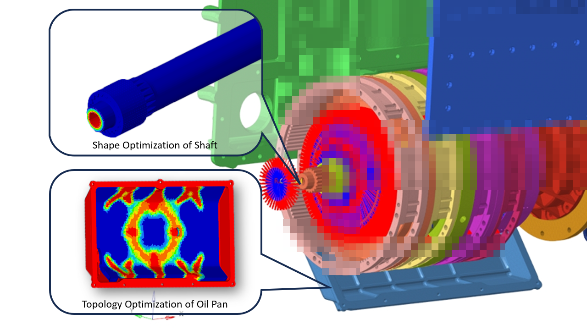
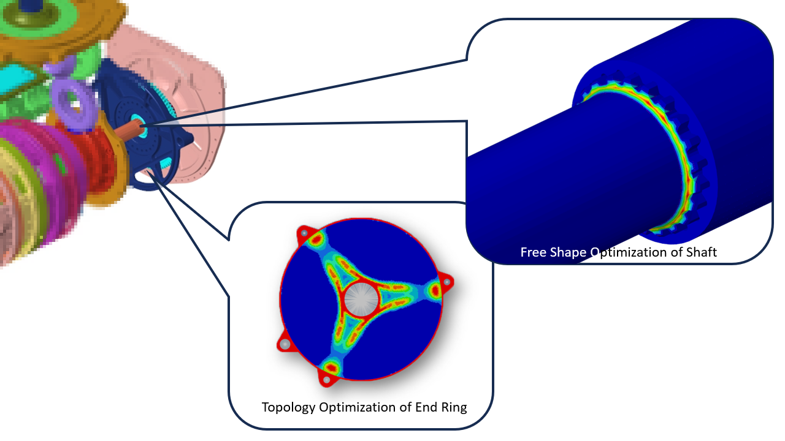

# Shibo's Altair Internship Work Sample (Gearbox)
 This page showcases one of Shibo's projects during his internship at Altair: Structural Optimization of a Gearbox Using HyperMesh. Selected models have been chosen for demonstration purposes.  *In accordance with Altair's guidelines, all images and models have been watermarked, and any sensitive information has been obscured to ensure the privacy and security of client data.  
 Optimization process of a few components is also provide:
- [<u>Topology Optimization of Gear</u>](/Portfolio/Altair_Intern_Samples/Gearbox_Sample/Altair_1.md)
-  Shape Optimization of Shaft

 The following optimization result is just one of many possible solutions generated: 

*NOTE: This page exclusively showcases Shibo's work accomplishments for personal skill demonstration.
The content is NOT qualified for, intended for, nor permitted to be used for any other purposes. In accordance with Altair's guidelines, all images and models have been watermarked, and any sensitive information has been obscured to ensure the privacy and security of client data.  

[Back to the Home Page](https://shibojia98.github.io/Portfolio/)
