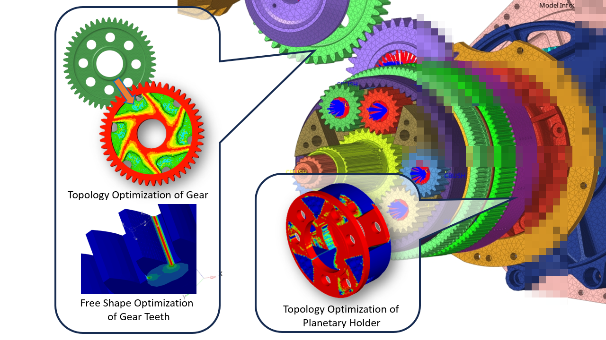

# Shibo's Altair Internship Work Sample (Gearbox)
This page showcases one of Shibo's projects during his internship at Altair: Structural Optimization of a Gearbox Using HyperMesh. Selected models have been chosen for demonstration purposes.
**NOTE: This page exclusively showcases Shibo's work accomplishments for personal skill demonstration.
<blockquote>The content is NOT qualified for, intended for, nor permitted to be used for, any commercial purposes. In accordance with Altair's guidelines, all images and models have been watermarked, and any sensitive information has been obscured to ensure the privacy and security of client data.</blockquote>*

