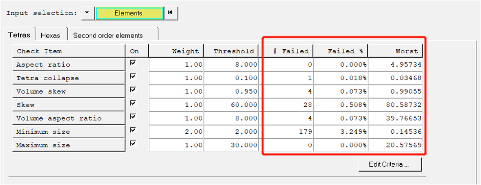
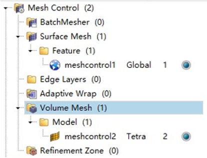
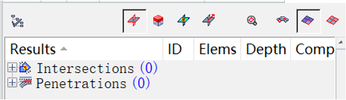
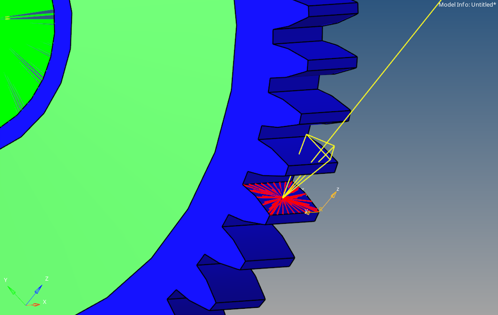
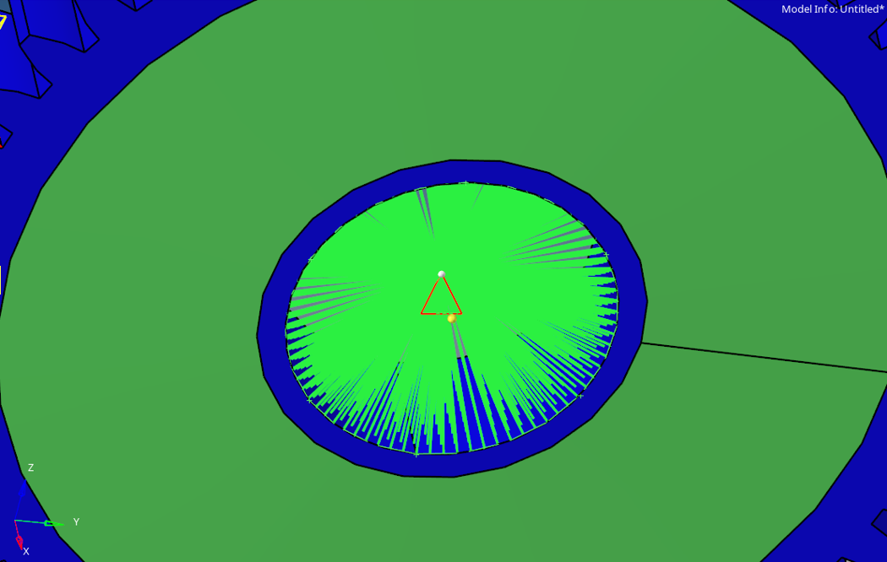
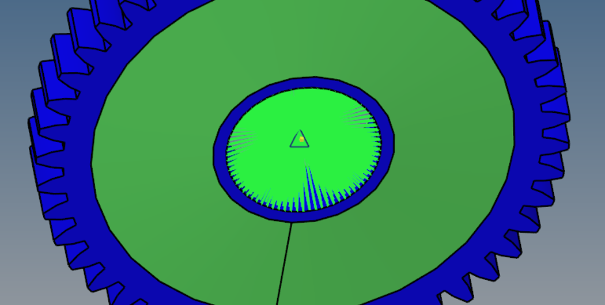
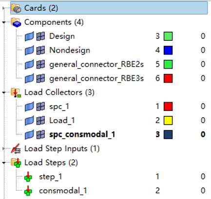
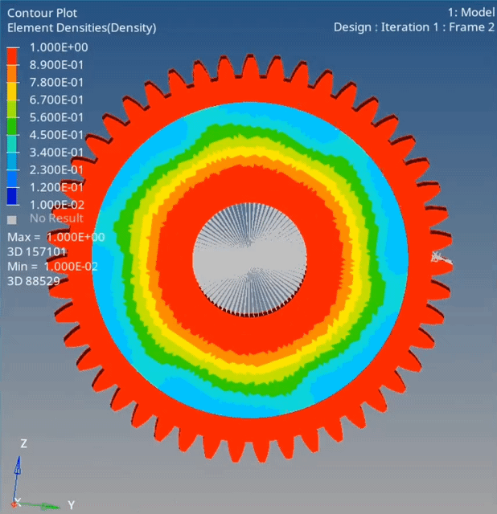

# Simple Demonstration of Gear Topology Optimization
The objective of this gear topology optimization is to optimize the material distribution of the design space between the root circle and the center to minimize weight.  
<a href="#target-position">*Click here to Comparsion Before & After </a>  
## Full Demonstration: 
 <b>Before Optimization:</b>  
 
 Geometry Cleanup:

  
  
Remove Fillet

  
  
Define Center Points of Circles

  
  
Create Construction Surface

  
  
Surface Cut

  
  
Delete Construction Surface

  
  
Delete Solid

  
  
Create Surfaces from Lines

  
  
Create a Solid from Surfaces (Design Space)

 

 <b>Mesh and Mesh Control:</b>

  
  
  

  

  
  
 <b>RBE2 & RBE3 Setup:</b>  
  

 <b>Material Setup: Skipped</b>  

 <b>Load Steps:</b>

  
  
Load Applied

  
  
Single Point Constraint

  
  
Model Constraint

  
  
Load Steps

 
 <b>Optimization Results:</b>  
   

<h2 id="target-position">Comparsion Before & After</h2>

For one selected solution, Density Threshold: 0.3, Max Displacement: 0.025mm at teeth, Min Vol., Unidirectional Draft; Cyclic Symmetry #: 6：
| Topology | Before   | After    |
|----------|----------|----------|
| Stress   | 32171.992     | 36319.941     |
| Displacement    | 0.025     | 0.025     |
| Modal 1    | 1.649883E+03     | 2.185571E+03     |
| Modal 2    | 1.650395E+03     | 2.186073E+03     |
| Modal 3    | 1.757600E+03     | 2.305663E+03     |
| Modal 4    | 2.018013E+03     | 2.471020E+03     |
| Modal 5    | 2.018914E+03     | 2.471894E+03     |
| Modal 6    | 2.958553E+03     | 3.003110E+03     |
| Modal 7    | 3.598404E+03     | 3.747645E+03     |
| Modal 8   | 3.598753E+03     | 3.963651E+03     |

[Back to Gearbox Sample Page](https://shibojia98.github.io/Portfolio/Altair_Intern_Samples/Gearbox_Sample/Altair_1.html) 
[Back to the Home Page](https://shibojia98.github.io/Portfolio/)
