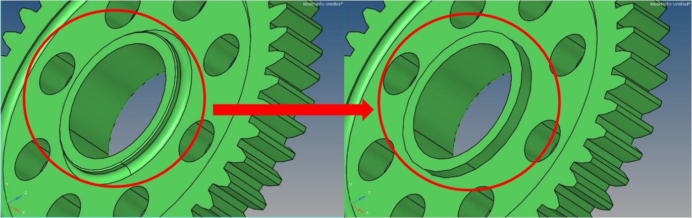
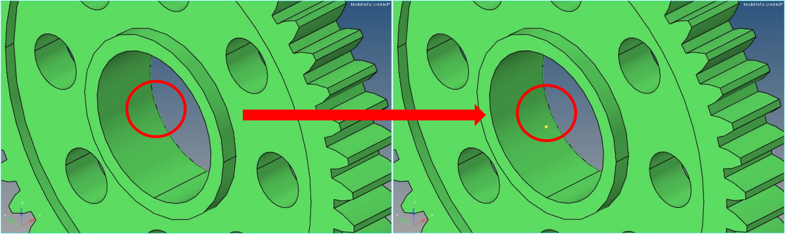
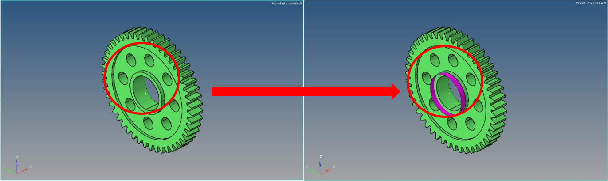
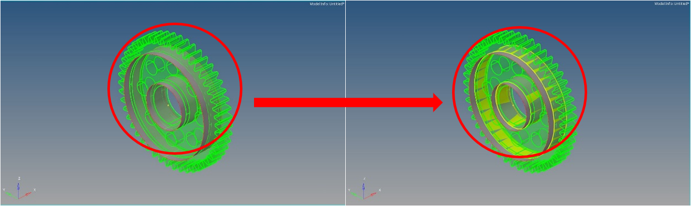
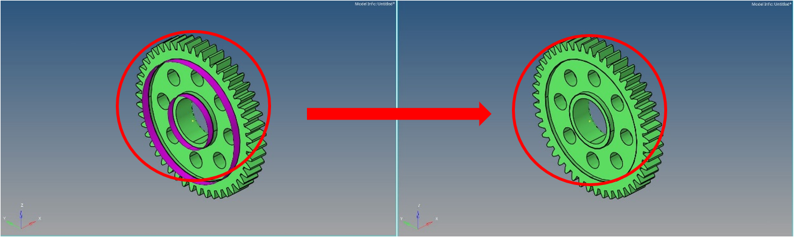
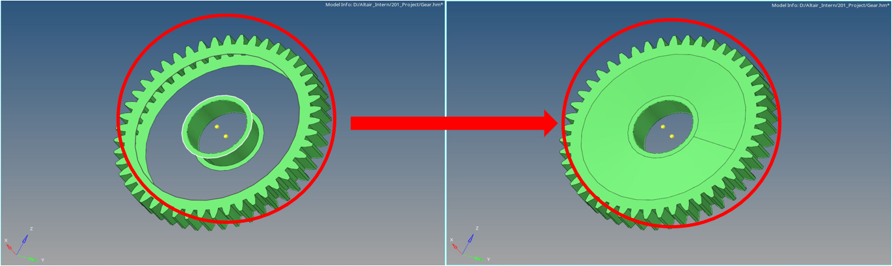

# Simple Demonstration of Gear Topology Optimization
 Before Optimization: 
 Mesh Details: 
 Geometry Cleanup: 

  
  
Remove Fillet

  
  
Define Center Points of Circles

  
  
Create Construction Surface

  
  
Surface Cut

  
  
Delete Construction Surface

  
  
Delete Solid

  
  
Create Surfaces from Lines

  
  
Create a Solid from Surfaces (Design Space)

 RBE2 & RBE3 Setup: 
