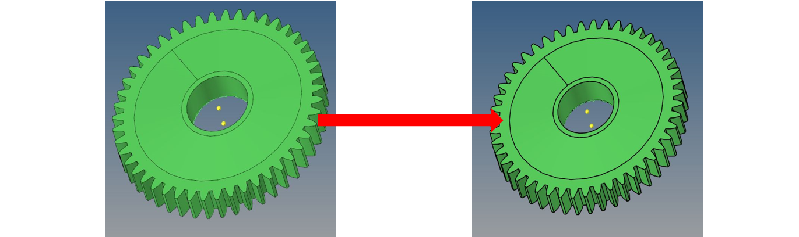

# Simple Demonstration of Gear Topology Optimization
 Before Optimization:  
 
 Geometry Cleanup:

  
  
Remove Fillet

  
  
Define Center Points of Circles

  
  
Create Construction Surface

  
  
Surface Cut

  
  
Delete Construction Surface

  
  
Delete Solid

  
  
Create Surfaces from Lines

  
  
Create a Solid from Surfaces (Design Space)

 
 Mesh and Mesh Control:

  
  
  

  
 RBE2 & RBE3 Setup:  
  

 Material Setup: Skipped  

 Load Steps:

  
  
Load Applied

  
  
Single Point Constraint

  
  
Model Constraint

  
  
Load Steps

