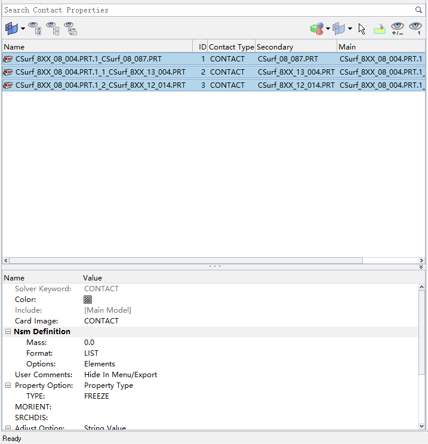

# Simple Demonstration of Shaft Shape Optimization

 Before Optimization:  
 

<!--GC-->
 Geometry Cleanup:

  
  
Define Center Points of Circles

  
  
Create Construction Cylinder Surface

  
  
Surface Cut

  
  
Delete Construction Surface

  
  
Delete Solid

 

<!--Mesh-->
 Mesh and Mesh Control:
  

<!--RBE-->
RBE2s:
  

<!--Contact-->
 Contacts:

Type: Freeze; Consolidate; Vicinity Tolerance: 1.0

  
  
  
  
 
  
<!--Material-->
 Material Setup: Skipped  

<!--Load Step-->
 Load Steps:

  
  
Moment Applied

  
  
Single Point Constraint

  
  
Model Constraint

  
  
Load Result

 

<!--Shape Optimization-->
 Shape Optimization:

Define Variable Elements
 

Optimization Processing
 

<!--Result-->
 Shape Optimization Result:

