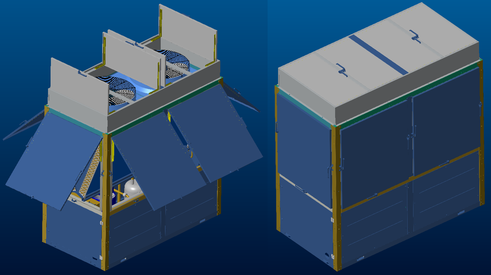
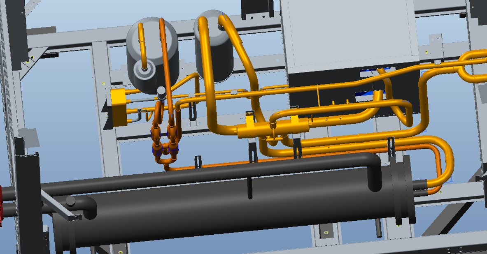

# Shibo’s HE Energy Internship Work Sample (R410A Air Cooling Unit)
 This page showcases Shibo's projects with respect to "HE R410A Air Cooling Unit" during his internship at HE Intelligent Energy.   
Protect Panel Added on: 
  
Internal Layout:
  
Redesign the plumbing layout configuration to accommodate the modified shell-and-tube heat exchanger:
   

[Back to the Home Page](https://shibojia98.github.io/Portfolio/)
