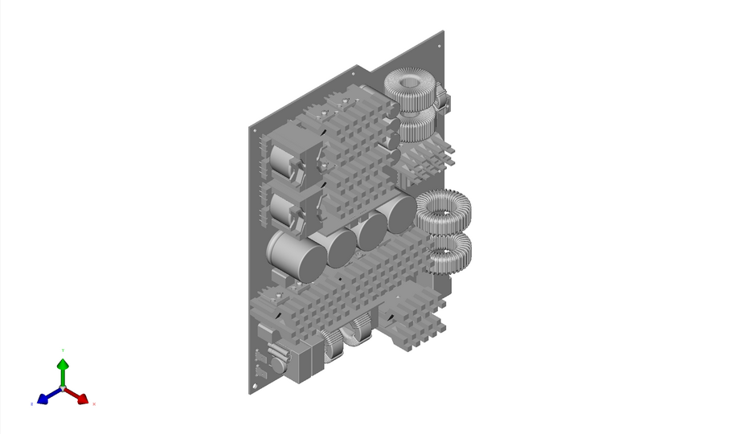
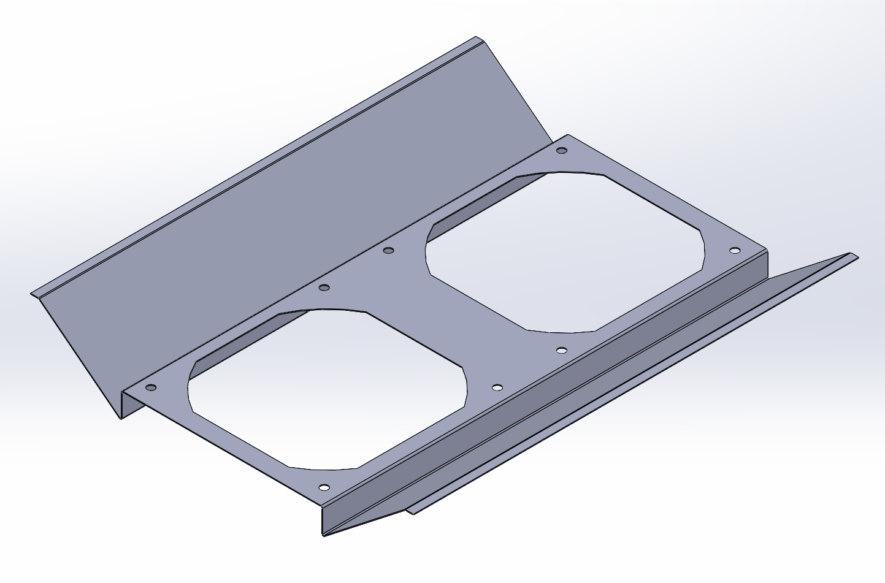
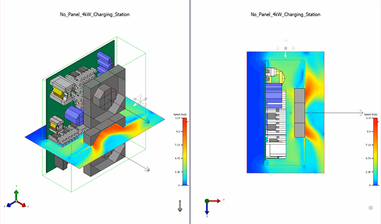
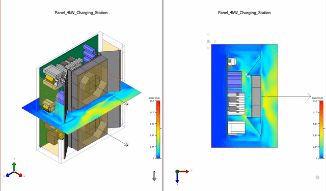
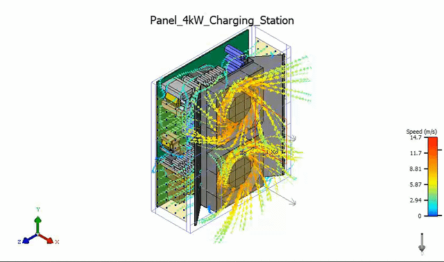

<a href="https://shibojia98.github.io/Portfolio/">Back to the Home Page</a>

<h1>4kW Power Supply Baffle Airflow Design</h1>

  This project presents the airflow optimization of a 4kW power supply charging station using Siemens Flotherm.
  The study focused on improving internal airflow distribution by designing a sheet-metal baffle to guide cooling air
  more effectively through high-heat components and reduce local recirculation zones.

<h2>Project Overview</h2>

  The original 4kW power supply assembly included power electronics, capacitors, magnetic components, heat sinks,
  cooling fans, and enclosure structures. A simplified MCAD model was imported into Flotherm to support thermal-fluid
  simulation while preserving the key geometry that affects airflow resistance and heat dissipation.

  The objective of this design was to improve cooling performance by modifying the internal air path with a customized
  baffle structure.

<h2>MCAD Model Simplification</h2>

  The original mechanical and electrical assembly was simplified for CFD simulation. Non-critical small features were
  removed while preserving major components, blockage regions, heat-generating parts, heat sinks, fans, and enclosure
  boundaries.

<h2>Baffle Design</h2>

  A custom sheet-metal baffle was designed to redirect fan-driven airflow toward the key heat-generating regions.
  The baffle helps prevent airflow short-circuiting and improves the utilization of cooling air across the internal
  components.

<h2>Airflow Comparison Before and After Optimization</h2>

  The following results compare the airflow speed distribution before and after adding the baffle structure.

<h3>Before Optimization</h3>

  Without the baffle, part of the airflow bypassed critical heat-generating areas. The flow distribution was less
  controlled, creating uneven cooling and potential hot spots inside the enclosure.

<h3>After Optimization</h3>

  After adding the baffle, the airflow path became more directed and uniform. The optimized design improved airflow
  coverage over the internal components and reduced inefficient flow regions.

<h2>Flow Trajectory Analysis</h2>

  The flow trajectory result shows how the optimized baffle guides air from the cooling fans through the power
  electronics area. The airflow path is more organized, helping improve convective heat transfer across the main
  thermal load regions.

<h2>Engineering Contribution</h2>

<ul>
  <li>Simplified the original MCAD model for Flotherm thermal-fluid simulation.</li>
  <li>Identified inefficient airflow paths and potential recirculation regions.</li>
  <li>Designed a sheet-metal baffle to guide airflow through key heat-generating components.</li>
  <li>Compared airflow speed distribution before and after optimization.</li>
  <li>Verified improved airflow direction using flow trajectory visualization.</li>
  <li>Supported thermal design improvement for a compact 4kW power supply charging station.</li>
</ul>

<h2>Tools Used</h2>

<ul>
  <li>Siemens Flotherm</li>
  <li>SolidWorks</li>
  <li>MCAD model simplification</li>
  <li>CFD-based airflow analysis</li>
  <li>Sheet-metal baffle design</li>
</ul>

 

<a href="https://shibojia98.github.io/Portfolio/">Back to the Home Page</a>
